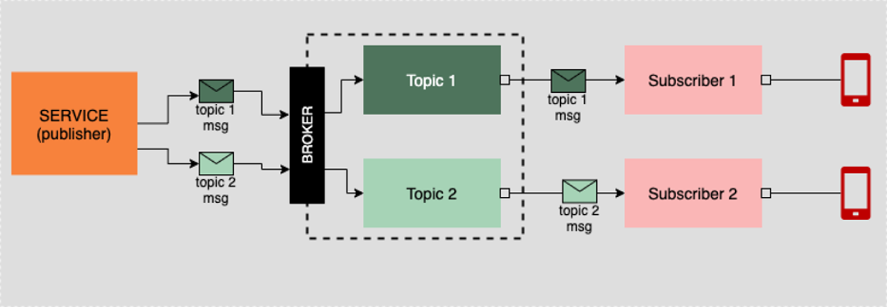
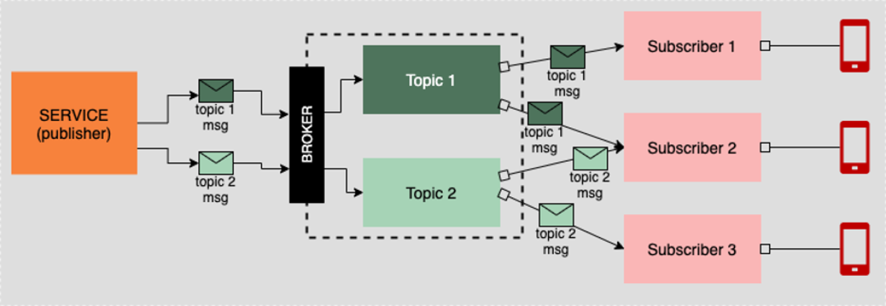
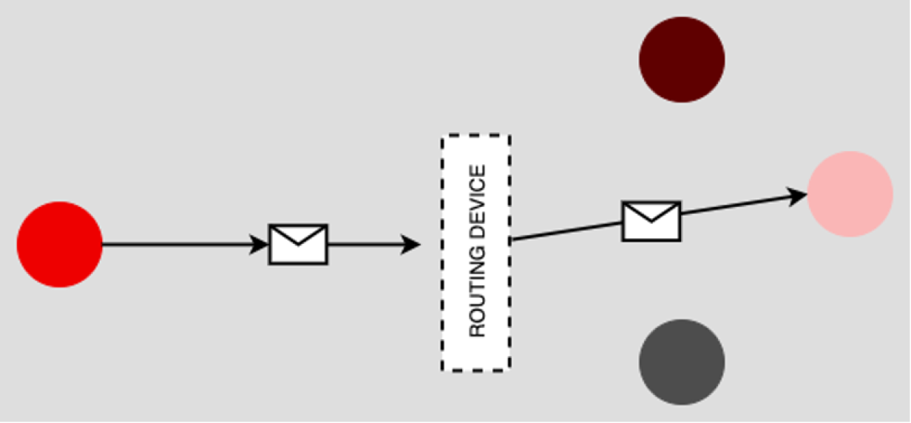
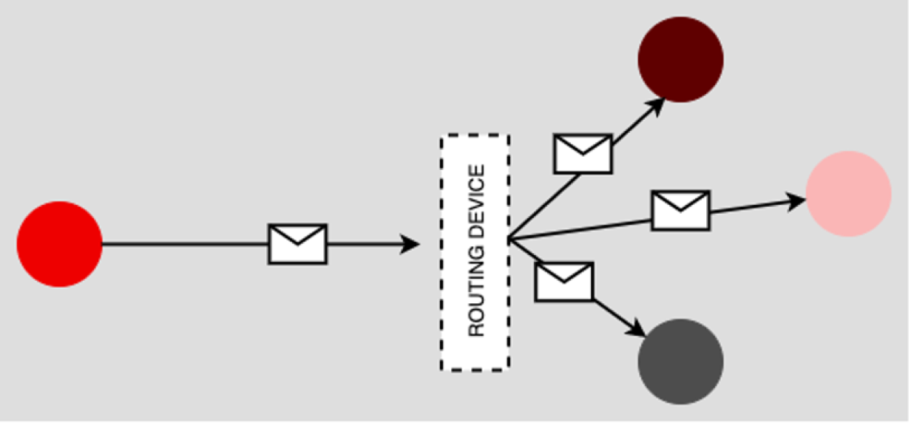
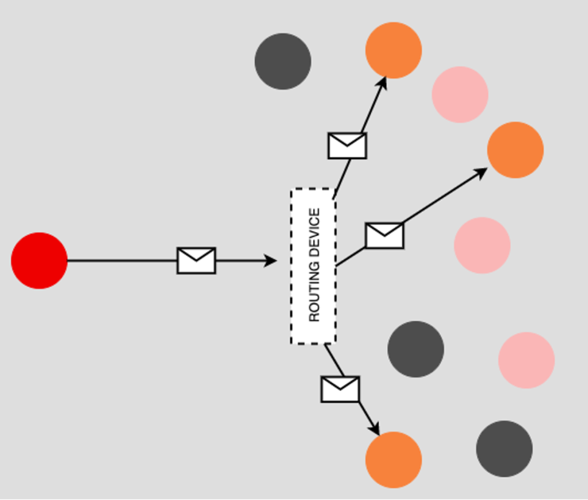
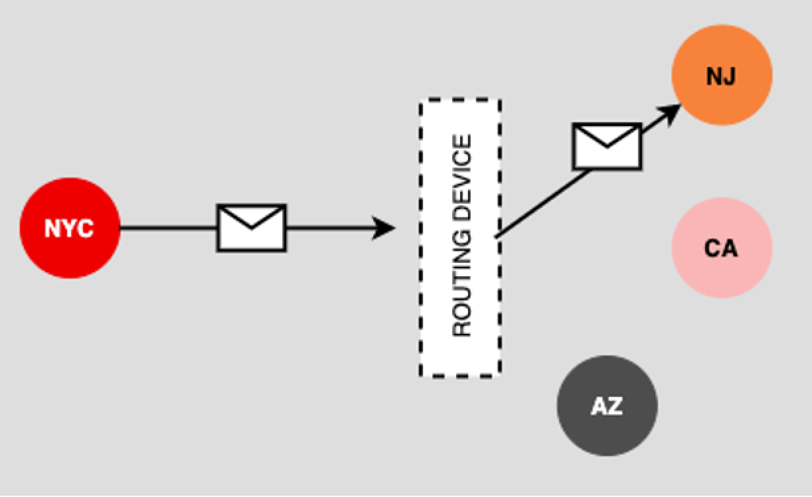

# Architectural messaging patterns: an illustrated guide

[Architectural messaging patterns: an illustrated guide](https://www.redhat.com/architect/architectural-messaging-patterns)

## **Message exchange architectures**

This section describes the messaging patterns that are relevant to the mechanism for transmitting messages between a sender and receiver.

### ****Pub-Sub****

A publisher pushes a message to topic/Inbox . A subscribers is linked to the topic and listens for messages being added. Once it gets a message, it processes it.

Typically need lots of information to be sent in the message body.

This is usually seen as one subscriber to one one topic

*Image source: https://www.redhat.com/architect/sites/default/files/styles/embed_large/public/2021-04/PubSub.png?itok=GAw162MP*

### Fanout

Same concepts as pub-sub but multiple subscribers are listening to a topic e.g Booking cancelled in Seaware. Activities Service cancels booked activities. F&B service cancels table booking.

*Image source: https://www.redhat.com/architect/sites/default/files/styles/embed_large/public/2021-04/Fanout.png?itok=0VUBHKHs*

### ****Unidirectional streaming****

Data is constantly being sent from a published to a subscriber, either directly or via a message broker.

### B****idirectional streaming****

Constant flow of data back a forth. Example is gRPC, which, once connection is established, allows data to flow between sender and receiver as required.

## Routing **exchange architectures**

### Unicast

App sends API requests. Internet knows how find API endpoint location, API sends response back.

*Image source: https://www.redhat.com/architect/sites/default/files/styles/embed_large/public/2021-04/Unicast.png?itok=pAPq0djP*

### Broadcast

Senders emits message to all receivers on network

> Under ARP, the router knows the physical devices on the network and then correlates the device identifier, the MAC address, to the logical IP address, and then forwards the message accordingly.
> 

*Image source: https://www.redhat.com/architect/sites/default/files/styles/embed_large/public/2021-04/Broadcast.png?itok=1jmyCC_e*

### ****Multicast****

Similar to broadcast but can have multiple groups of receivers. Live broadcasts over internet involve sender sending message to group of devices people are watching stream on.

*Image source: https://www.redhat.com/architect/sites/default/files/styles/embed_large/public/2021-04/Broadcast.png?itok=1jmyCC_e*

### ****Anycast****

Receiver must meet certain conditions for the router to send a message to it 

*Image source: https://www.redhat.com/architect/sites/default/files/styles/embed_large/public/2021-04/Anycast.png?itok=XqwQO1qb
