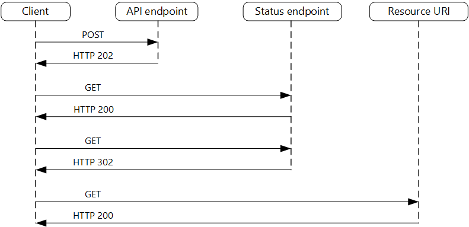

# Asynchronous Request Reply Pattern

[Asynchronous Request-Reply pattern - Azure Architecture Center](https://learn.microsoft.com/en-us/azure/architecture/patterns/async-request-reply)

In most cases, front end needs quick response form REST API (less than 100ms)

For long running processes. Endpoint could initial return a 202 accepted and a location to use to poll for the status. Status is 200 and body of pending/in progress

When status is completed, can either return 200 and body success/complete status.

Or auto redirect to url of newly created resource and return this as the body

*Image source: https://learn.microsoft.com/en-us/azure/architecture/patterns/_images/async-request.png*

An HTTP 202 response should indicate the location and frequency that the client should poll for the response. It should have the following additional headers:

| Header | Description | Notes |
| --- | --- | --- |
| Location | A URL the client should poll for a response status. | This URL could be a SAS token with the https://learn.microsoft.com/en-us/azure/architecture/patterns/valet-key being appropriate if this location needs access control. The valet key pattern is also valid when response polling needs offloading to another backend |
| Retry-After | An estimate of when processing will complete | This header is designed to prevent polling clients from overwhelming the back-end with retries. |

## **When to use this pattern**

Use this pattern for:

- Client-side code, such as browser applications, where it's difficult to provide call-back endpoints, or the use of long-running connections adds too much additional complexity.
- Service calls where only the HTTP protocol is available and the return service can't fire callbacks because of firewall restrictions on the client-side.
- Service calls that need to be integrated with legacy architectures that don't support modern callback technologies such as WebSockets or webhooks.

This pattern might not be suitable when:

- You can use a service built for asynchronous notifications instead, such as Azure Event Grid.
- Responses must stream in real time to the client.
- The client needs to collect many results, and received latency of those results is important. Consider a service bus pattern instead.
- You can use server-side persistent network connections such as WebSockets or SignalR. These services can be used to notify the caller of the result.
- The network design allows you to open up ports to receive asynchronous callbacks or webhooks.

- A request id could be generated as part of the request. This could be return in the initial response and/or