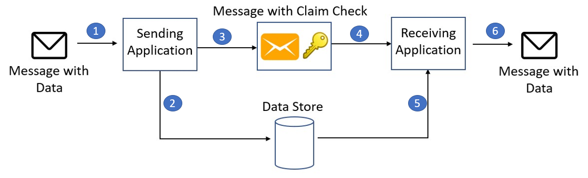

# Claim Check Pattern
[https://learn.microsoft.com/en-us/azure/architecture/patterns/claim-check](https://learn.microsoft.com/en-us/azure/architecture/patterns/claim-check)

## **Overview**
- Used for processing large messages
- Also referred to as Reference-Based messaging
  
Split a large message into a claim check, sent to the messaging platform. And a payload, sent to an external service. Large payloads aren't handled by message queue/broker/bus, which helps with performance.

Message could contains large files e.g audio,video or images.

Most messaging platforms are designed to handle lots of message, but with small payloads. So they typically have message size limits.

General flow could be:

1. Send message
2. Store payload in external service/storage
3. Message reference is added to queue
4. Other systems read the message and its reference
5. Other systems retrieve payload using reference and process the message

*Image source: https://learn.microsoft.com/en-us/azure/architecture/patterns/_images/claim-check.png*

## Issues and Considerations

- Consider implementing a process to deleting data stored to save costs
  - Could be periodically
  - Could be once message is processed by all consumers
- Consider only using this pattern if message payload exceeds certain size
  - More resource/time involved due needing to handle storage and retrieval of data
  - Size could be based on your own metric or restrictions by messaging broker/bus

## When to use this pattern
- When chosen message bus has message payload size limits
- For secure/sensitive data that you only want certain system to access
  - Can implement strict authentication and authorisation requirements to retrieve payload from storage